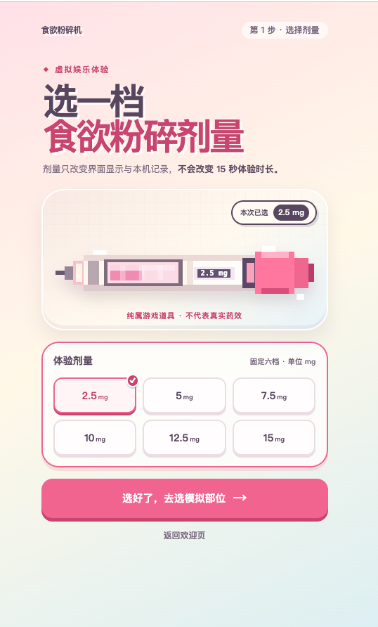
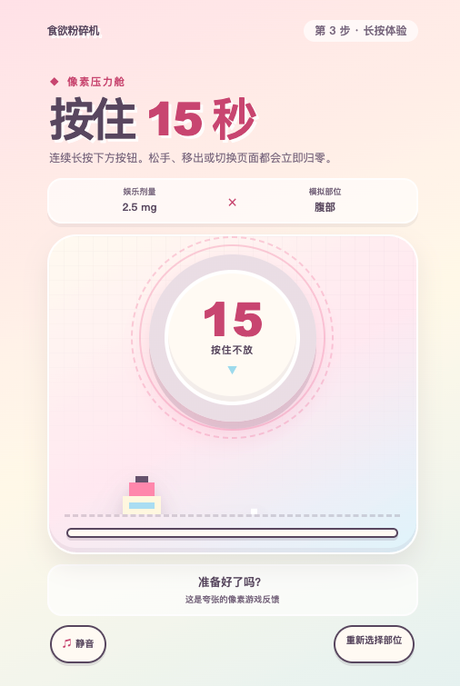

# 食欲粉碎器

基于 `SPEC.md` 搭建的 Next.js 手机网页项目。产品界面名称按规格使用“食欲粉碎机”。

## 在线体验

项目已部署，可直接在线访问：

👉 [点击访问食欲粉碎机](https://appetite-crusher.vercel.app/)

> 本网站仅供娱乐，不代表真实药效或医疗建议。

## 界面预览

### 🌸 欢迎页

🏠 打开网站即可看到娱乐定位、15 秒体验提示和免责声明，也可以从这里开始体验或查看本机历史记录。


### 🎮 剂量选择页

🎀 从六档固定游戏剂量中选择一档。选择只影响界面显示与本机记录，不代表剂量推荐或真实药效。



### ⏱️ 15 秒长按体验

🎵 按住中央按钮完成 15 秒虚拟体验；松手、移出或切换页面时进度会立即归零。声音与震动仅作为可选的游戏反馈。



## 技术栈

- Next.js App Router
- TypeScript（严格模式）
- Tailwind CSS
- ESLint
- 纯前端静态导出

## 本地运行

```bash
npm install
npm run dev
```

打开 `http://localhost:3000`。

## 检查

```bash
npm run lint
npm run typecheck
npm run build
```

## 目录

- `src/app`：欢迎页与五个核心流程路由
- `src/components`：共享页面外壳、按钮和像素视觉
- `src/features/injection`：15 秒长按体验相关逻辑
- `src/features/history`：本机记录和连续打卡逻辑
- `src/features/share`：客户端分享图逻辑
- `src/lib/browser`：浏览器能力检测与降级
- `src/types`：剂量、部位和历史记录类型
- `public`：图标、原创图片和合法授权音频

当前阶段是可运行的基础工程：欢迎页已具备基础视觉，其余流程页面是明确标注的开发骨架，完整交互仍待实现。
